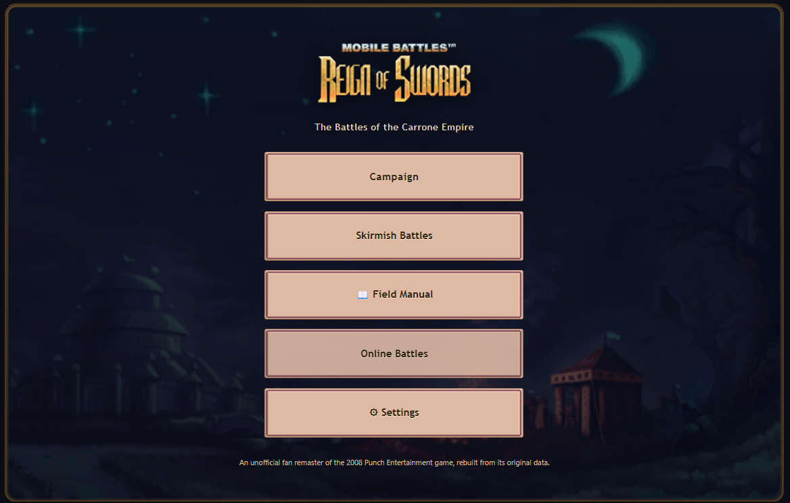
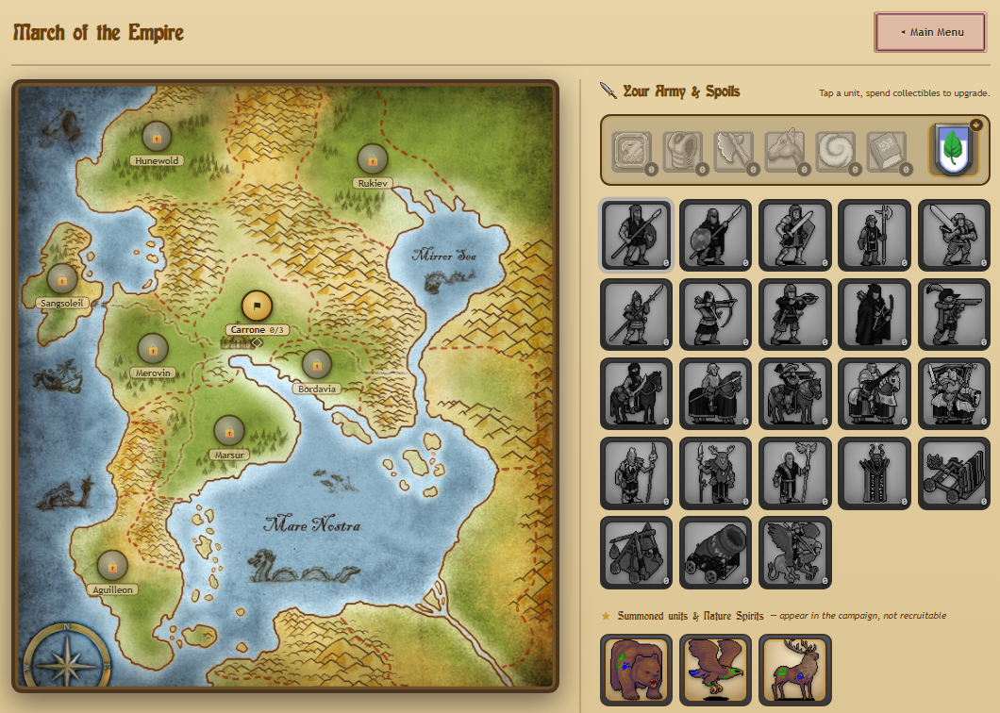
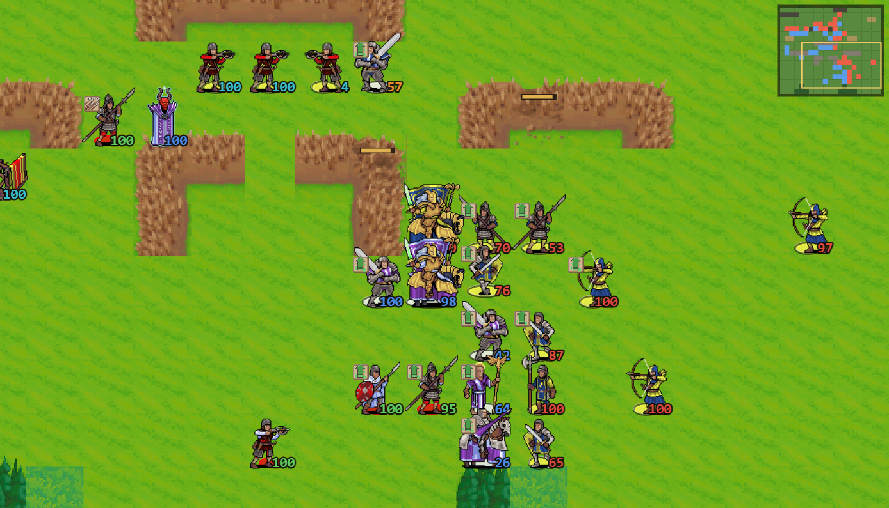
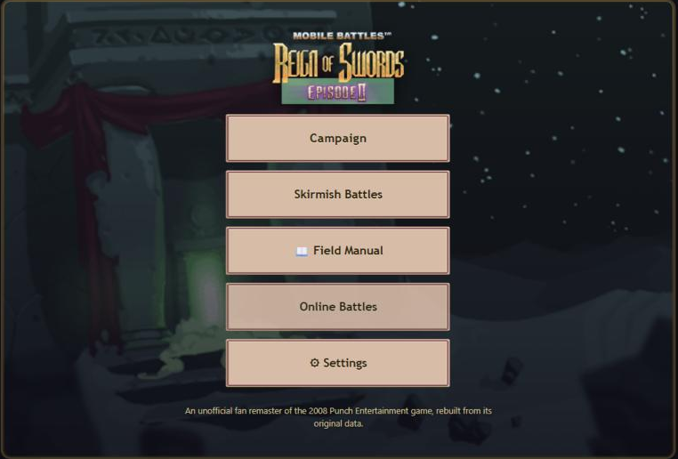

<h1 align="center">⚔️ Reign of Swords Remastered</h1>

<p align="center">
  <b>An unofficial fan remaster of Punch Entertainment's iPhone tactics games<br>
  <i>Mobile Battles: Reign of Swords</i> (2008) and <i>Reign of Swords Episode II</i> (2009),<br>
  rebuilt from the original game data to play in the browser.</b>
</p>

<p align="center">
  <a href="https://dmytro-portfolio-website.vercel.app/games/reign-of-swords"><b>▶ Play Episode I</b></a>
  &nbsp;·&nbsp;
  <a href="https://dmytro-portfolio-website.vercel.app/games/reign-of-swords-2"><b>▶ Play Episode II</b></a>
  &nbsp;·&nbsp;
  <a href="#run-it-locally">Run it locally</a>
</p>

<p align="center">
  
</p>

---

## Why I made this

I played Reign of Swords on an iPhone 4 during my summer holidays, when I was about fourteen, and I never got past
**Caladrin Defense** in Episode II. It stayed with me.

The games have long been gone from every store, but years later I found, through Reddit, a Discord of enthusiasts
who still kept the iOS and Android files. So I dug the game out of the grave to get my rematch and finally close that
chapter. Caladrin Defense is hard even now: after rebuilding the whole game, I still lost it three times in a row — it
takes a specific tactic I simply didn't have at fourteen. In the end I crushed it, not without tips from the AI in my
own Battle Lab, and it still felt like a win.

It was a fun game, and I still consider it one of the benchmarks of turn-based medieval strategy: the epic feel, the
army composition, the pace and the core mechanics.

## The game

Lead Sir Varius and the armies of the Empire of Carrone in turn-based battles on the original maps, with the original
units, damage tables, scripted missions and enemy AI, decoded from the iOS games' own data and code.

- **Two full campaigns.** Episode I's 24 missions to win back the breakaway kingdoms of the Empire, and Episode II's 33
  missions that carry the war into the desert lands of Zayandi, Sabbi Amar and Abbisin.
- **The original army.** Knights, Pikemen, Swordsmen, Archers, Crossbowmen, Musketeers, Rangers, Horse Bowmen,
  Griffon Riders, Wizards, Druids, Catapults, Trebuchets and Cannon — plus Episode II's Craftsmen, Ballistae,
  Conjurers, Sappers, Bodyguards, Dune Sirens and Blood Gorgers.
- **Sieges** with destructible walls, gates and houses; raids with Medals for a Major Victory; army upgrades and the
  Merchant.
- **Skirmishes and hot-seat** on any battlefield, for one player or two on one device.
- **The Field Manual and Story & Assets**: every unit and terrain explained, the full story, interactive map and
  animation atlases, and the Battle Lab, which plays whole battles with the Autopilot to compare armies and tactics.
- **English, Russian and Ukrainian**, on desktop and phone.

<table>
  <tr>
    <td width="50%"></td>
    <td width="50%"></td>
  </tr>
  <tr>
    <td align="center"><sub>The campaign — the world map, your army and its spoils</sub></td>
    <td align="center"><sub>Defense of the Emperor (Carrone 3) — knights and pikes against the rebel line</sub></td>
  </tr>
  <tr>
    <td colspan="2" align="center"></td>
  </tr>
  <tr>
    <td colspan="2" align="center"><sub>Episode II</sub></td>
  </tr>
</table>

## Only on the website

This repository holds the same game as the website: the same code and the same data. The website adds online features
around it that need its own backend:

| | On the website | Here |
| --- | :---: | :---: |
| Both campaigns, skirmishes, hot-seat, Field Manual, Story & Assets, Battle Lab | ✅ | ✅ |
| **Online battles** — open lobbies (optionally with a password), secret musters, every move live, a clock on each turn | ✅ | — |
| **Ratings and a leaderboard**, under a public name you choose | ✅ | — |
| **An account** (GitHub or e-mail) with **cloud saves** that follow you to every device | ✅ | — |
| **Offline play** once the game has been opened online | ✅ | — |

Here, nobody is signed in, progress is saved in your browser only (`localStorage`), and the Online Battles menu says
online battles are not available on this build — hot-seat still works.

## Run it locally

You need [Node.js](https://nodejs.org/) 20.19 or newer.

```bash
npm install
npm start
```

`npm start` opens the game at <http://localhost:5173>. Episode I opens by default; switch to Episode II with the
link above the game, or open <http://localhost:5173/#reign-of-swords-2>.

| Command | What it does |
| --- | --- |
| `npm start` | Dev server, opens the browser |
| `npm run dev` | Dev server without opening the browser |
| `npm run build` | Production build into `dist/` |
| `npm run preview` | Serves the production build |
| `npm test` | Unit tests (Vitest, jsdom) |
| `npm run lint` | ESLint over the game code |
| `npm run format` | Prettier over the game code |
| `npm run e2e:maps` | The map runner: whole battles played by the Autopilot (slow) |

## How it is built

```
src/
  reign-of-swords/          the game — identical to the website's copy
    engine/ rules/ ai/        battle engine, game rules, the original AI
    render/ ui/               canvas rendering and the React screens
    data/ i18n/ online/       data loaders, RU/UK translations, online play (switched off here)
    __tests__/ e2e/           unit tests and the map runner
    docs/                     notes on the code
  components/GameLoader.*   the loading spinner the game uses
  auth/AuthContext.jsx      offline stand-in: nobody is signed in
  lib/supabase.js           offline stand-in: no backend, online battles are off
  site.js                   the origin the game's search metadata uses
  main.jsx, app.css         the page around the game (theme, buttons, Episode I / II switch)
public/games/
  reign-of-swords/          Episode I data, sprites, audio, UI art, MECHANICS.md, DATA-NOTES.md
  reign-of-swords-2/        Episode II data (shares Episode I's sprites and audio)
public/ros-atlas/           the interactive map and animation atlases (Story & Assets)
tools/ros/                  Python tools that extracted and audited the data from the original iOS games
docs/images/                the screenshots in this README
```

React and Vite, an HTML canvas for the battlefield, no other runtime dependencies. The game rules, the decoded
original code and every deliberate difference from the original games are documented in
[`MECHANICS.md`](public/games/reign-of-swords/MECHANICS.md).

<details>
<summary><b>Keeping in step with the website</b> (for the maintainer)</summary>

Sync is manual. To bring this repository up to date, copy over from the website project:

- `src/reign-of-swords/` (everything except `node_modules/`)
- `public/games/reign-of-swords/` and `public/games/reign-of-swords-2/`
- `public/ros-atlas/`
- `tools/ros/` (without `bin/`; keep this repository's `rosdat.py` paths and the "Sir Varius" example in
  `export_levels.py`)
- `src/components/GameLoader.jsx` and `GameLoader.css`, if they changed

Leave out `src/reign-of-swords/docs/AI-HANDOFF.md` (the author's own working note; it is git-ignored here). Then run
`npm test` and `npm run lint`. The files under `src/auth/`, `src/lib/`, `src/site.js`, `src/main.jsx`, `src/app.css`
and `docs/` belong to this repository and are not copied.

</details>

<details>
<summary><b>Data tools</b></summary>

The scripts in `tools/ros/` read the original games' files (the iOS `reignofswords.dat` archives and app binaries),
which are **not** included. Set `ROS_DAT_EP1` / `ROS_DAT_EP2` to your own copy of each episode's `reignofswords.dat`,
or place them at `extracted-assets/ios-episode-<n>/_raw/` beside this repository. The game itself does not need them:
everything it uses is already exported to `public/games/`.

</details>

## Found a bug?

Let me know: open an issue on [GitHub](https://github.com/Tsarar/reign-of-swords-remastered/issues) or message me on [LinkedIn](https://bit.ly/dmytro-linkedin).
Please include what you can:

- **A debug snapshot.** In a battle, press 🐞 in the top bar: it copies a snapshot of the battle (units, turn, the
  recent AI moves and every dice roll) to the clipboard. Paste it into the issue, or attach it as a `.txt` file.
- **Screenshots** of what looks wrong.
- **A description**: what you did, what happened, and what you expected instead.
- **Why you think it is wrong**, if it is about faithfulness to the original game: what you remember from playing
  it, a video, or a reference to the code or data (for example a section of
  [`MECHANICS.md`](public/games/reign-of-swords/MECHANICS.md)).

## Disclaimer

This is a non-commercial fan project. It is not affiliated with, endorsed by or connected to Punch Entertainment.
Reign of Swords, its names, characters, art, music and sounds belong to their respective owners.

If you hold rights to Reign of Swords and want any of this material removed, open an
[issue](https://github.com/Tsarar/reign-of-swords-remastered/issues) or message me on
[LinkedIn](https://bit.ly/dmytro-linkedin), and it will be taken down.

Built with AI: the code, the decoding of the original games' data and binaries, and the documentation were written
together with Claude, Anthropic's AI model.
